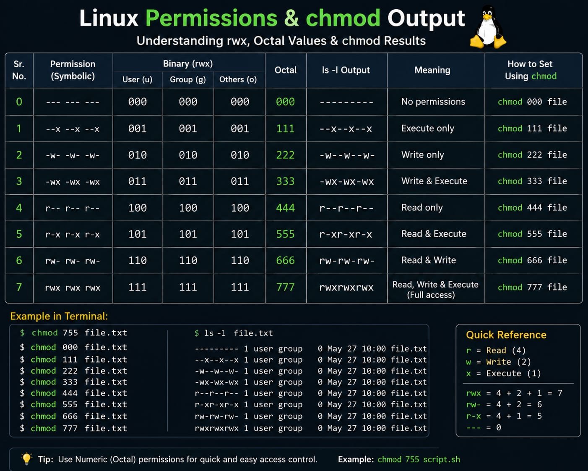
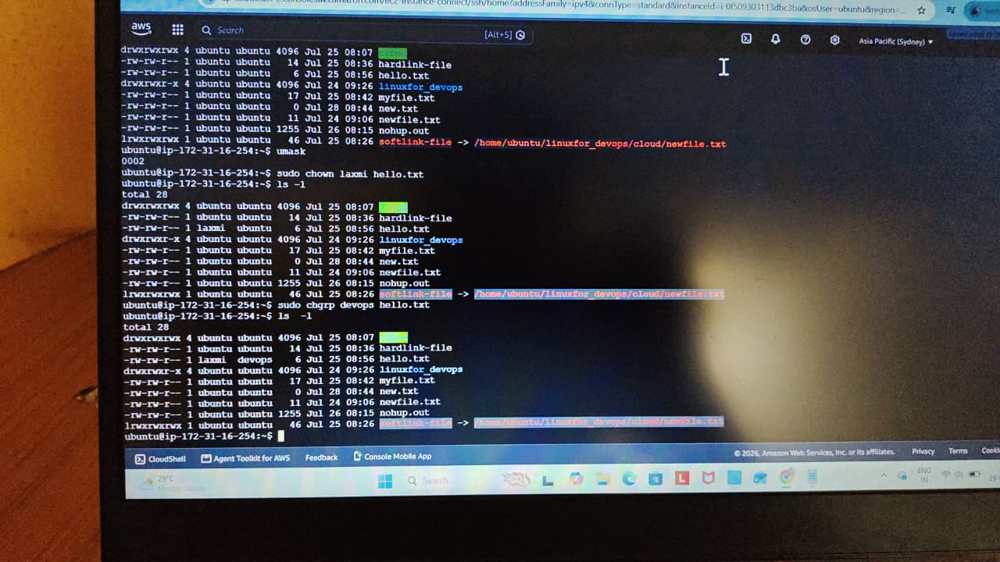
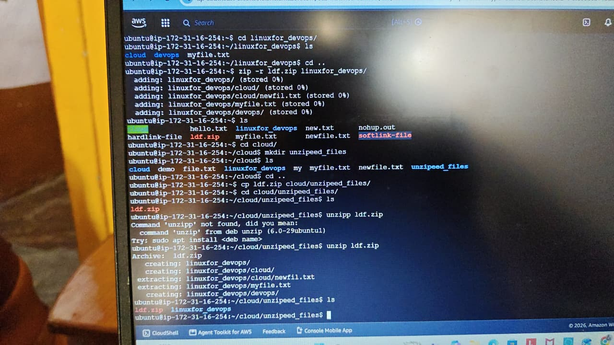

# Day 09 - Linux Permissions, Compression & File Transfer Commands

##  Topics Covered

### 1. Linux File Permissions
- Read (r)
  
- Write (w)
  
- Execute (x)
  
- User (u), Group (g), Others (o)
  
- Numeric Permissions (0–7)
  
- chmod command
  
- Common chmod values:
  
  - 000 → No permissions
  - 111 → Execute only
  - 222 → Write only
  - 333 → Write + Execute
  - 444 → Read only
  - 555 → Read + Execute
  - 666 → Read + Write
  - 777 → Full permissions (Read + Write + Execute)

---

## chmod Command

### Syntax
bash
chmod <permissions> <filename>

### Examples
bash
chmod 777 file.txt
chmod 755 script.sh
chmod 644 notes.txt
chmod +x script.sh
chmod -w file.txt

---

## chown Command

Changes the owner of a file or directory.

### Syntax

bash
chown user filename

### Example

bash
sudo chown ubuntu file.txt

---

## chgrp Command

Changes the group ownership.

### Syntax

bash
chgrp groupname filename

### Example

bash
sudo chgrp developers file.txt

---

# Compression Commands

## zip

Compress files.

bash
zip project.zip file1.txt file2.txt

## unzip

Extract zip files.

bash
unzip project.zip

## gzip

Compress a single file.

bash
gzip file.txt

## gunzip

Extract gzip file.

bash
gunzip file.txt.gz

## tar

Create archive

bash
tar -cvf backup.tar folder/

Extract archive

bash
tar -xvf backup.tar

---

# File Transfer Commands

## SCP (Secure Copy)

Copy files securely over SSH.

bash
scp file.txt user@server:/home/user/

Copy from remote server.

bash
scp user@server:/home/user/file.txt .

---

## rsync

Synchronize files and directories.

bash
rsync -av source/ destination/

Example

bash
rsync -av Documents/ Backup/

---

# Commands Practiced

- chmod
- chown
- chgrp
- zip
- unzip
- gzip
- gunzip
- tar
- scp
- rsync

---

# Key Learnings

- Understanding Linux file permissions.
- Using chmod to change permissions.
- Changing file ownership with chown.
- Managing groups with chgrp.
- Compressing and extracting files.
- Secure file transfer using SCP.
- Synchronizing files using rsync.

  ## Peactice

### Screenshot 1

### Screenshot 2

### Screenshot 3

### Screenshot 4

##  Follow my *90-Day DevOps Journey* as I learn DevOps from beginner to advanced by documenting my daily progress.
