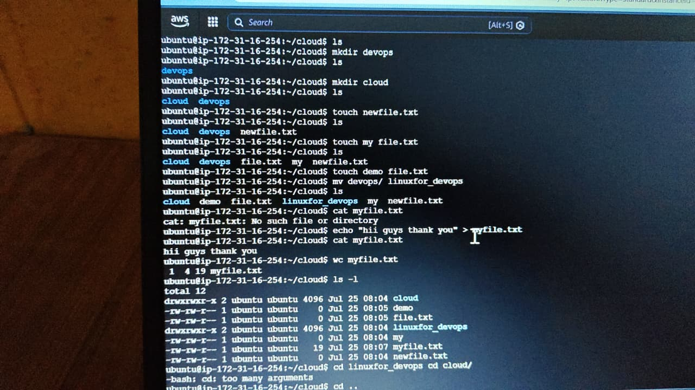
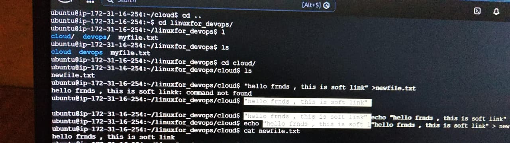
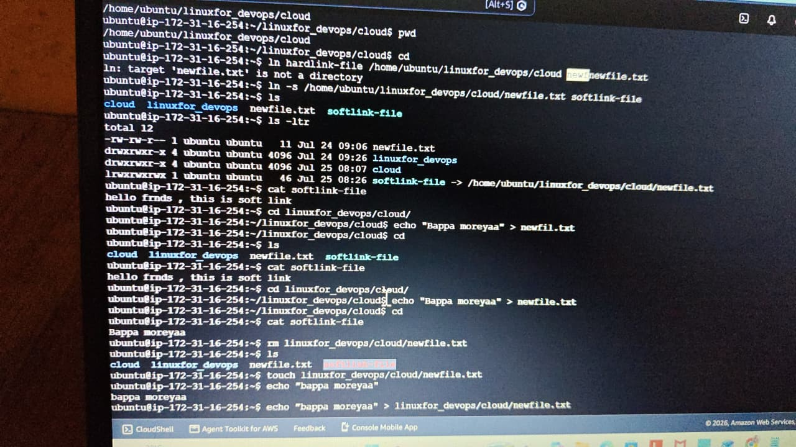
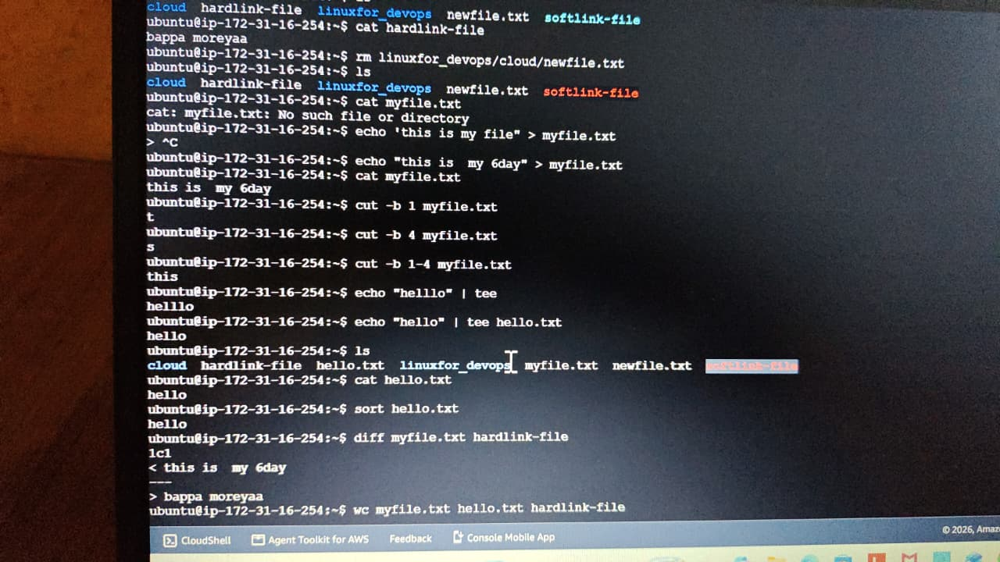
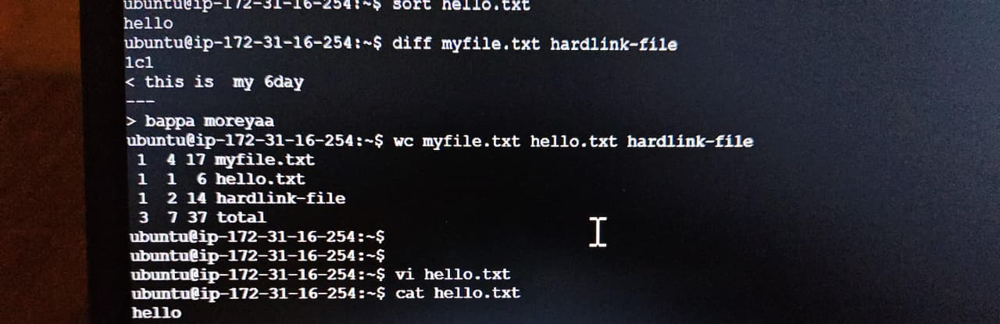

## Day 06 – Advanced Linux File Operations & Utilities

## Objective

Today, I practiced essential Linux terminal operations including soft/hard links, text manipulation (cut, tee, sort, diff), file counts (wc), and 
standard navigation commands directly on AWS CloudShell.

## Commands Learned

* ln
* cut
* tee
* sort
* diff
* wc
* vi

## Commands Practiced

**ln (Soft & Hard Links)**: Created and tested symbolic shortcuts (ln -s) and direct physical links (ln).
**cut**: Filtered out specific bytes/characters from text streams (e.g., cut -b 1-4).
**tee**: Directed output simultaneously to the terminal standard output and a destination file (echo "hello" | tee hello.txt).
**sort**: Alphabetically ordered lines inside a file (sort hello.txt).
**diff**: Compared two files line-by-line to identify differences (diff myfile.txt hardlink-file).
**wc**: Calculated line, word, and character/byte counts (wc myfile.txt hello.txt hardlink-file).
**vi**: Created and edited text content using standard terminal editor modes.
**cat & Redirection (>)**: Wrote and displayed file contents.

## Hands-on Terminal Log & Examples
# 1. Working with Links
 
 # Creating a Soft (Symbolic) Link
ln -s /home/ubuntu/linuxfor_devops/cloud/newfile.txt softlink-file

# Creating a Hard Link
ln linuxfor_devops/cloud/newfile.txt hardlink-file

# Verifying links with detailed list
ls -ltr

# 2. Text Processing Utilities
# Slicing specific bytes using 'cut'
cut -b 1-4 myfile.txt

# Writing to screen and file at the same time using 'tee'
echo "hello" | tee hello.txt

# Sorting file contents
sort hello.txt

# Comparing differences between two files
diff myfile.txt hardlink-file

# 3. File Statistics & Editing
# Inspecting line, word, and character counts across multiple files
wc myfile.txt hello.txt hardlink-file

# Editing a file using standard vi editor
vi hello.txt

## Key Takeaways
Soft Links (-s) point to the file path/shortcut; breaking the original file invalidates the soft link.
Hard Links point to the underlying inode/data directly, preserving access even if the original target path changes.
Using piping (|) combined with tools like tee, cut, and diff allows rapid log parsing and data inspection in production environments.

## Practice 

### Screenshot 2: Creating Links

### Screenshot 3: Text Processing Commands

### Screenshot 4: File Comparisons & Counts

### Screenshot 5: Terminal Output

