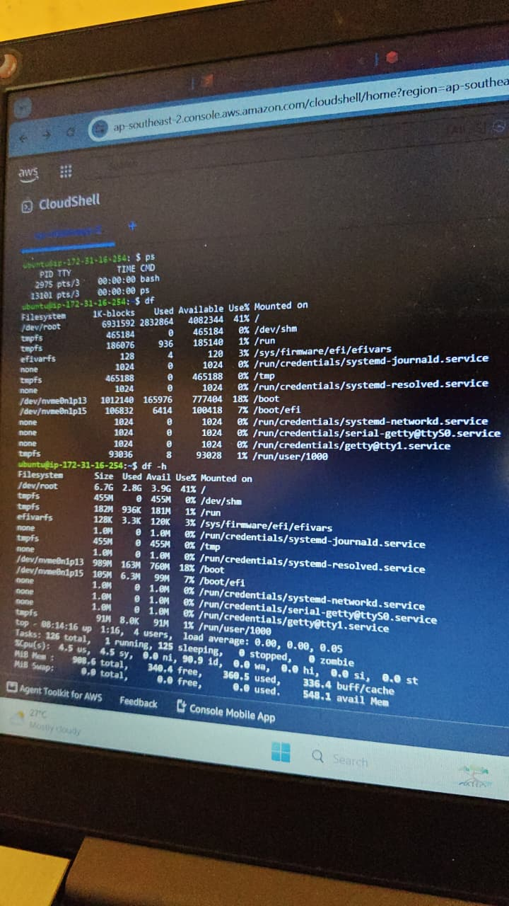
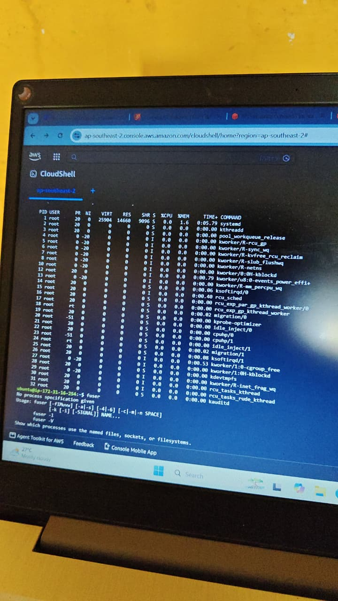
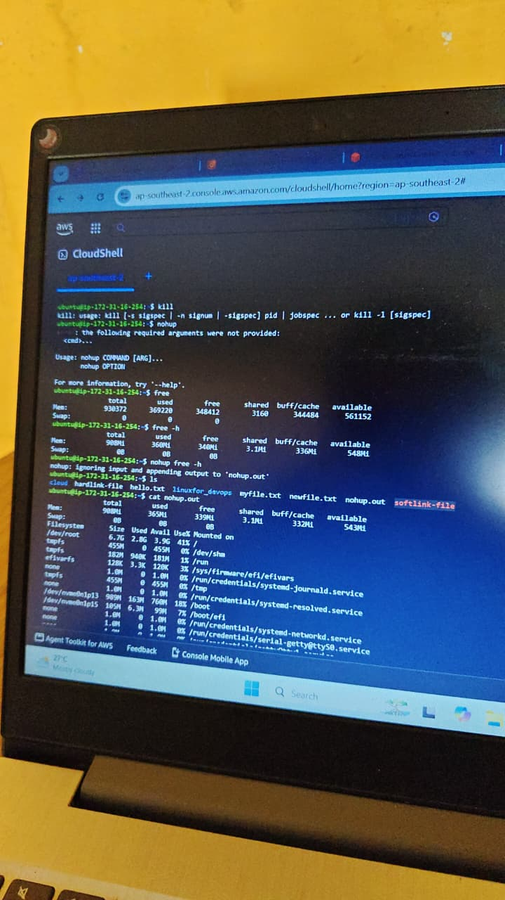
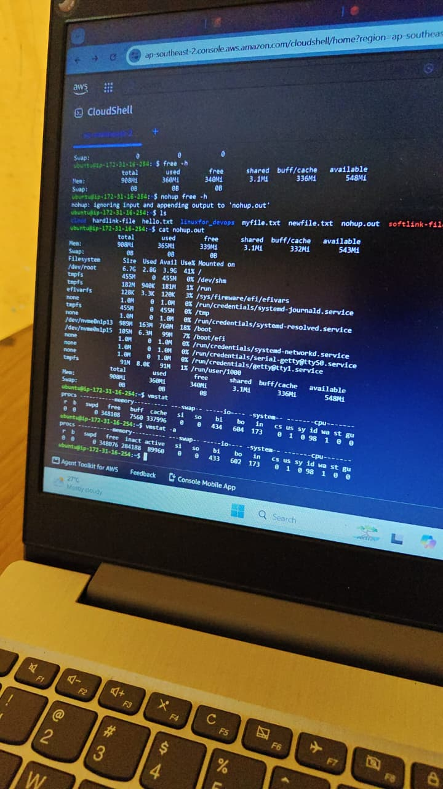
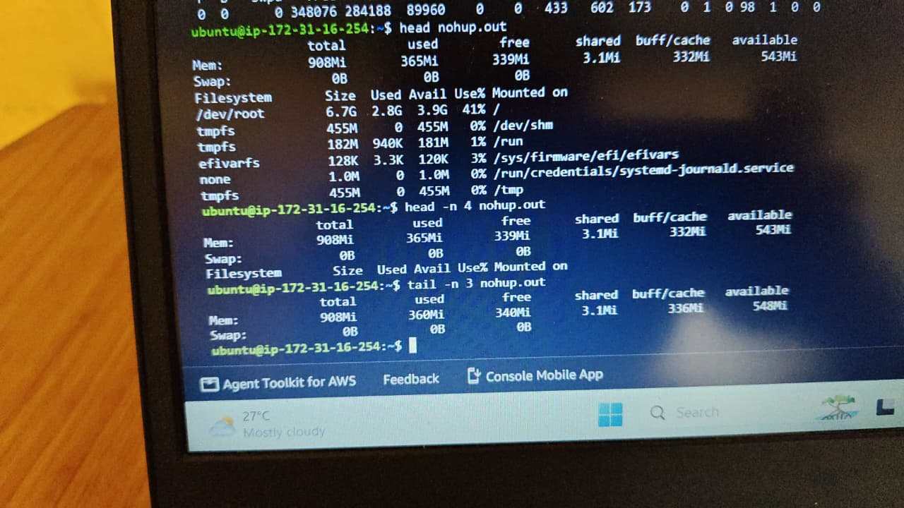

# Day 07 – Linux Process Management & System Monitoring

##  Objective

Today, I learned Linux process management and system monitoring commands on an AWS EC2 Ubuntu instance using AWS CloudShell.

## Environment

- AWS EC2 (Ubuntu 26.04 LTS)
- AWS CloudShell
- SSH Connection

##  Commands Learned

### Process Management

bash
ps
top
kill
fuser

### Disk Usage

bash
df
df -h

### Memory Usage

bash
free
free -h
vmstat
vmstat -a

### Background Processes

bash
nohup free -h
cat nohup.out
head nohup.out
head -n 4 nohup.out
tail -n 3 nohup.out

---

## What I Learned

- Monitored running processes using ps.
- Used top to monitor CPU and memory usage.
- Checked disk space using df and df -h.
- Viewed RAM and swap memory using free and free -h.
- Monitored system performance using vmstat.
- Learned how to run background jobs using nohup.
- Viewed output files using cat, head, and tail.

##  Key Takeaways

- Learned Linux process management.
- Understood disk and memory monitoring.
- Practiced background process execution.
- Improved Linux troubleshooting skills.

## Practice
### Screenshot 1

### Screenshot 2

### Screenshot 3

### Screenshot 4

### Screenshot 5

## ✅ Status

*Day 07 Completed Successfully ✅*
