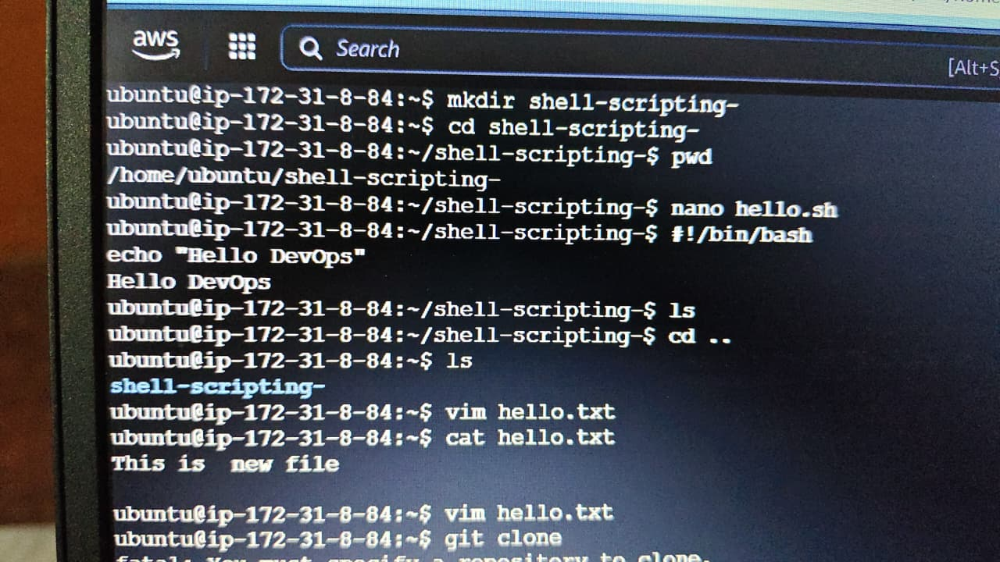
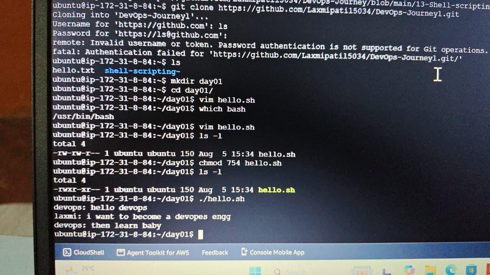

# Day 01 - Shell Scripting for DevOps

## Topics Covered
- Introduction to Shell Scripting
- What is Bash?
- Creating a Shell Script
- Shebang (#!/bin/bash)
- echo Command
- chmod Command
- Executing a Shell Script

## Commands Practiced

bash
mkdir day01
cd day01
vim hello.sh
which bash
chmod 754 hello.sh
./hello.sh

## Sample Script

bash
#!/bin/bash

echo "Hello DevOps"
echo "This is my first shell script"

## Output

Hello DevOps
This is my first shell script

## Learning Outcome

- Understood how Bash executes shell scripts.
- Learned to create, edit, and run shell scripts.
- Practiced file permissions using chmod.

  ## 📸 Practice Screenshots

### Practice 1

### Practice 2

## 🚀 Conclusion
Shell Scripting is a fundamental DevOps skill that helps automate repetitive tasks and improves productivity.

---
⭐ Follow my *90 Days of DevOps Journey* for more learning updates.
