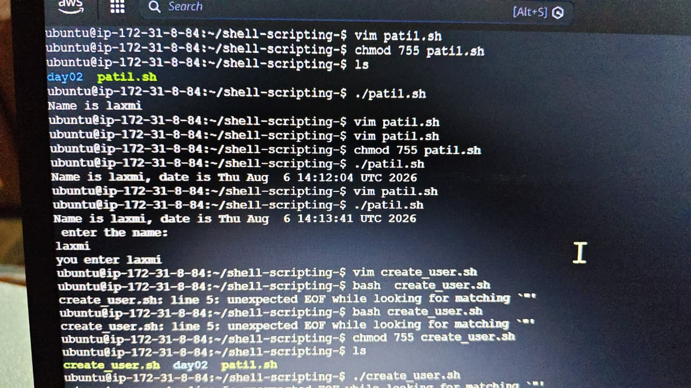
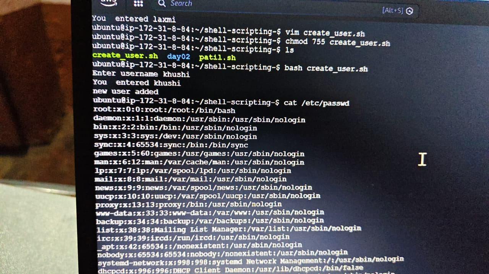
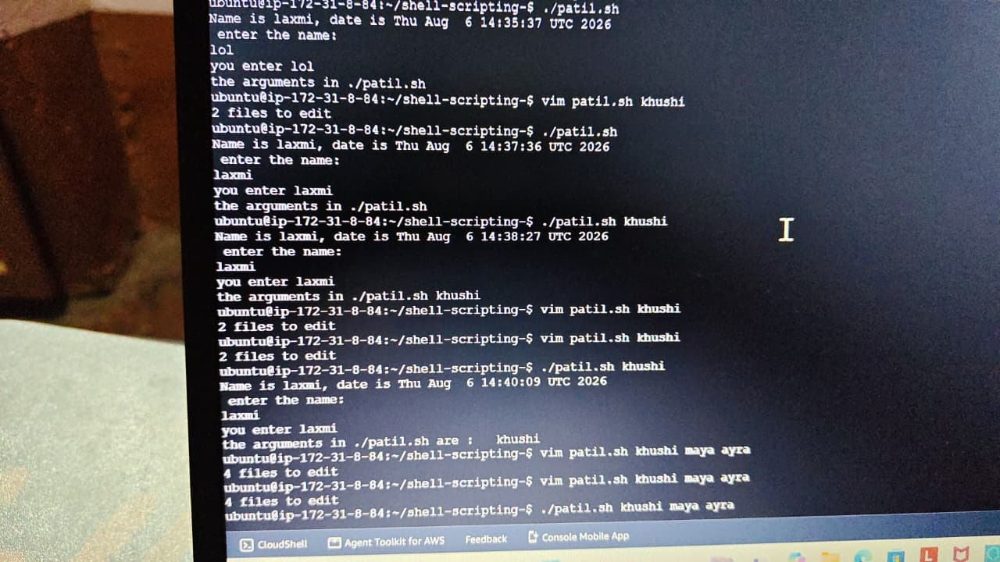
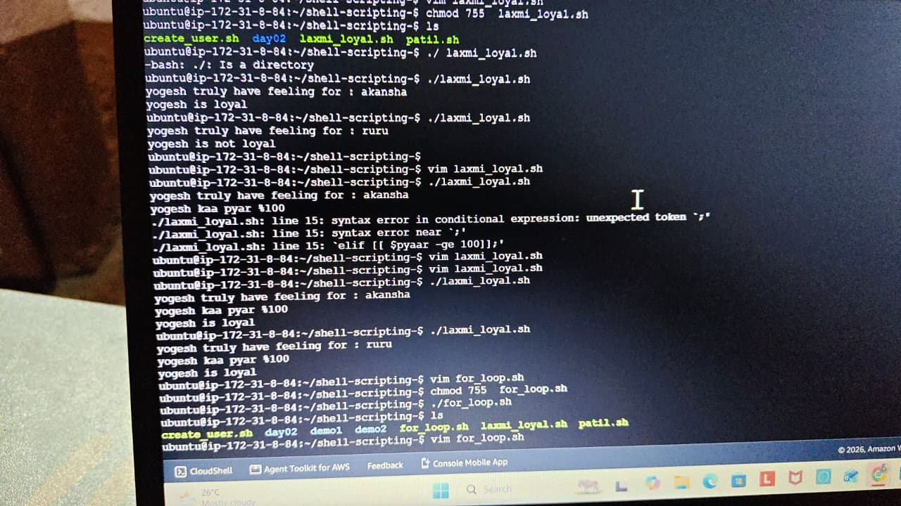
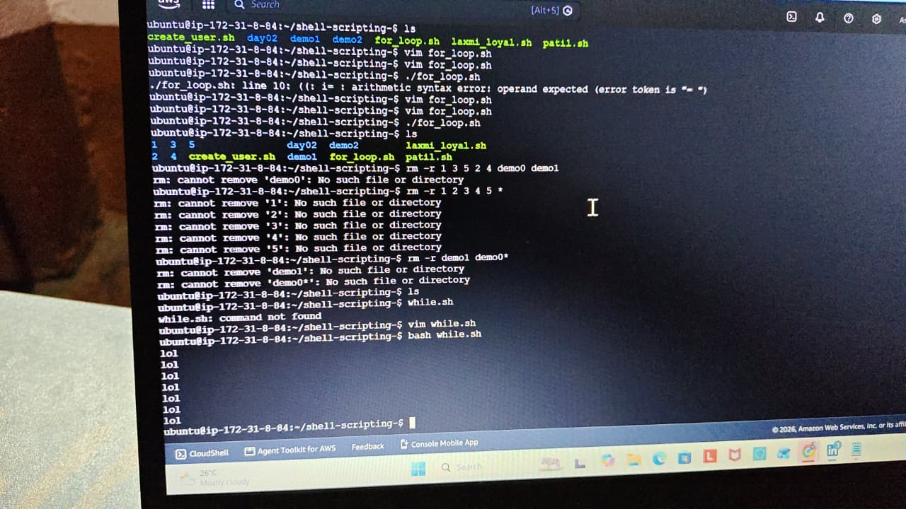

# Day 02 - Shell Scripting Basics

## 📌 Project Overview

On Day 02 of my #90DaysOfDevOps journey, I learned the fundamentals of Bash Shell Scripting and created multiple scripts to understand automation in Linux.

This project covers variables, user input, conditional statements, loops, file permissions, and user creation using shell scripts.

---

## 🎯 Objective

The objective of this project is to understand the basics of Shell Scripting and automate simple Linux administration tasks.

---

## 📚 Topics Covered

- Variables
- Echo Command
- User Input using `read`
- Command Line Arguments (`$1`, `$2`, `$@`)
- Conditional Statements
  - if
  - elif
  - else
- Creating Linux Users
- For Loop
- While Loop
- File Permissions (`chmod`)
- Executing Shell Scripts

---

## 🛠️ Scripts Created

- `patil.sh`
- `create_user.sh`
- `laxmi_loyal.sh`
- `for_loop.sh`
- `while.sh`

---

## 💻 Linux Commands Practiced

```bash
vim
chmod 755
./script.sh
bash script.sh
read
echo
if
elif
else
for
while
useradd
ls
cat
```

---

## 📖 Key Concepts Learned

- Writing Bash Shell Scripts
- Accepting User Input
- Using Variables
- Working with Conditional Statements
- Creating Loops
- Automating Linux Tasks
- Managing File Permissions
- Executing Shell Scripts

---

## 📸 Project Screenshots

### 1️⃣ Shell Scripting Practice



---

### 2️⃣ Conditional Statements



---

### 3️⃣ Loop Execution



---

### 4️⃣ User Creation Script




### 5️⃣ Additional Shell Scripting Practice


---

## 🚀 Project Outcome

By completing this project, I gained hands-on experience with Bash Shell Scripting, Linux commands, conditional statements, loops, and basic automation. These concepts form the foundation for DevOps automation and Linux system administration.

---

## 📌 Technologies Used

- Linux
- Bash Shell
- Git
- GitHub
- AWS EC2

---

### ⭐ If you found this project useful, don't forget to Star the repository!

#90DaysOfDevOps #Linux #ShellScripting #Bash #AWS #Git #GitHub #DevOps
